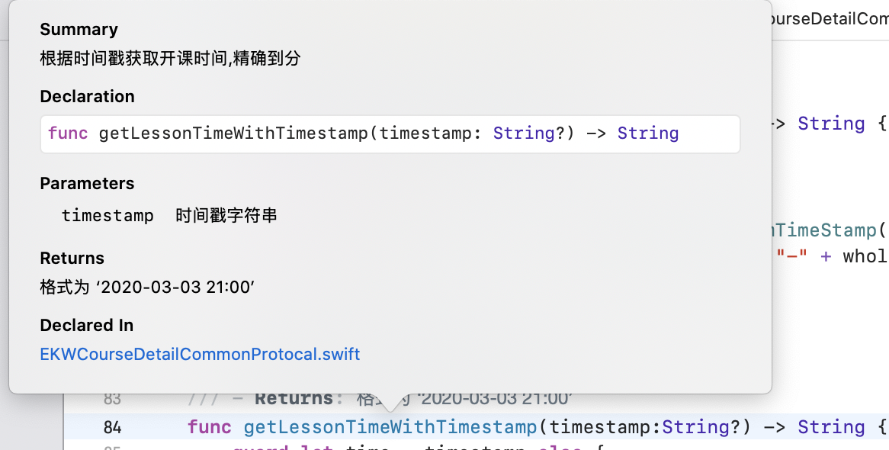
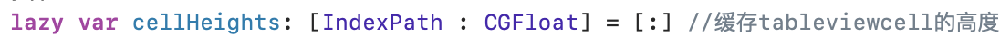
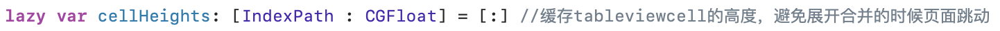

# Swift 4.2语法规范

## 注释

一般情况下，_方法，协议等自定义的内容_ 需要写注释，_属性_ 在需要补充说明的情况下需要写注释。_系统方法_ 不需要写注释

### Xcode的document功能

_方法，类，协议，结构体_ 等，推荐使用Xcode自带的document功能进行注释。

* 使用方法：

  1. 按住⌘点击_方法，类，协议，结构体_ 名，在弹出的菜单选择_Add Documentation_即可自动生成注释，如下图。
  2. 光标在_方法，类，协议，结构体_ 定义那一行的情况下，使用快捷键 ⌃+⌘+/（可以自定义设置或者修改）

* 一般来说参数，返回值都需要明确注释以便日后维护。使用add document添加注释之后,按住⌥点击方法名，可以有明确的注释出现，如下图。
 

* 示例

  ```swift
  /// 根据时间戳获取开课时间,精确到分
  /// - Parameter timestamp: 时间戳字符串
  /// - Returns: 格式为 ‘2020-03-03 21:00’
  func getLessonTimeWithTimestamp(timestamp:String?) -> String
  ```

    
* [document的更多用法](https://swift.org/documentation/api-design-guidelines/)

### 注释规范

* **注释必须及时更新或删除**

    在使用版本控制的情况下。无效的代码或者注释及时删掉，如果不确定代码以后有没有可能用到，提交时写好commit，保证在需要的时候能找回来即可。

    注释掉的代码，90%都不会再用到。
  * 推荐

    ```Swift
    override func tableView(_ tableView: UITableView, numberOfRowsInSection section: Int) -> Int {
      return Database.contacts.count
    }
    ```

  * 不推荐

    ```Swift
    override func didReceiveMemoryWarning() {
      super.didReceiveMemoryWarning()
      // Dispose of any resources that can be recreated.
    }

    override func numberOfSections(in tableView: UITableView) -> Int {
      // #warning Incomplete implementation, return the number of sections
      return 1
    }

    override func tableView(_ tableView: UITableView, numberOfRowsInSection section: Int) -> Int {
      // #warning Incomplete implementation, return the number of rows
      return Database.contacts.count
    }
    ```

* 注释的作用是解释“为什么这么做”，而不是“做了些什么”

  * 示例：
    * 做了些什么（不推荐）
    
    * 为什么这么做（推荐）
    

* 少使用`/* ... */`，尽可能地用`//`或`///`代替。[为什么](https://stackoverflow.com/questions/61022236/why-the-need-to-avoid-c-style-comments-in-swift)

## 命名规范

* 清晰的优先级是高于简洁的
* 类型、属性、变量、常量都应该用名词来命名
* classes, structures, enumerations and protocols 等类型名字以首字母大写驼峰命名。变量、方法名以小写驼峰方式命名，不要使用下划线

    示例：

    ```Swift
    let maximumNumberOfLoginAttempts = 10
    var currentLoginAttempt = 0
    ```

* 缩写和简写应该要尽量避免，遵守苹果命名规范，缩写和简写中的所有字符大小写要一致。

    ```Swift
    let decimalInteger = 17
    let binaryInteger = 0b10001       // 17 in binary notation
    let octalInteger = 0o21           // 17 in octal notation
    let hexadecimalInteger = 0x11     // 17 in hexadecimal notation
    ```

* 根据规则命名而不是根据类型命名
  * 推荐

    ```Swift
    var string = "Hello"
    protocol ViewController {
      associatedtype ViewType : View
    }
    class ProductionLine {
      func restock(from widgetFactory: WidgetFactory)
    }
    ```

  * 不推荐

    ```Swift
    var string = "Hello"
    protocol ViewController {
      associatedtype ViewType : View
    }
    class ProductionLine {
      func restock(from widgetFactory: WidgetFactory)
    }
    ```

* 避免用深奥的单词。如果“skin”可以用，就不要用“epidermis”
* 不要有拼写错误，发现后立刻改过来，方便以后全局搜索

## 方法相关

* 清晰是首要目标

    尽可能地避免歧义。
  * 推荐

    ```Swift
    extension List {
        public mutating func remove(at position: Index) -> Element
    }
    employees.remove(at: x)
    ```

  * 不推荐

    ```Swift
    extension List {
        public mutating func remove(position: Index) -> Element
    }
    employees.remove(x) // 不清晰: x是下标还是元素?
    ```

  参数使用规则尽量明确，必要时加上一些名词或介词进行补充说明。
  * 推荐

    ```Swift
    func addObserver(_ observer: NSObject, forKeyPath path: String)
    grid.addObserver(self, forKeyPath: graphics)
    ```

  * 不推荐

    ```Swift
    func add(_ observer: NSObject, for keyPath: String)

    grid.add(self, for: graphics)
    ```

* 保证清晰的前提下尽量简洁

  * 推荐

    ```Swift
    public mutating func remove(_ member: Element) -> Element?

    allViews.remove(cancelButton)
    ```

  * 不推荐

    ```Swift
    public mutating func removeElement(_ member: Element) -> Element?

    allViews.removeElement(cancelButton)
    ```

* 尽量保证可读性

  * 符合英文语法规范，组成短语
    * 推荐

      ```Swift
      x.insert(y, at: z)          “x, insert y at z”
      x.subViews(havingColor: y)  “x's subviews having color y”
      x.capitalizingNouns()       “x, capitalizing nouns”
      ```

    * 不推荐

      ```Swift
      x.insert(y, position: z)
      x.subViews(color: y)
      x.nounCapitalize()
      ```

    初始化方法或者工厂方法例外，如：
    * 推荐

      ```Swift
      let foreground = Color(red: 32, green: 64, blue: 128)
      let newPart = factory.makeWidget(gears: 42, spindles: 14)
      let ref = Link(target: destination)
      ```

    * 不推荐

      ```Swift
      let foreground = Color(havingRGBValuesRed: 32, green: 64, andBlue: 128)
      let newPart = factory.makeWidget(havingGearCount: 42, andSpindleCount: 14)
      let ref = Link(to: destination)
      ```

  * 工厂方法以```make```开头，比如```x.makeIterator()```
  * 根据影响性命名
    * 不产生影响的方法读起来应该像名词短语，例如：```x.distance(to: y)```, ```i.successor()```
    * 产生影响的方发读起来应该像动词短语，例如：```x.sort()```, ```x.append(y)```、```print(x)```
    * 改变对象，用动词。如：```x.sort()```,```x.append(y)```
    * 不改变对象，以“ed“或者”ing“结尾。如：```z = x.sorted()```,```z = x.appending(y)```
    * 当我们用名词来表示操作的时候，可变的用“form”作前缀，如：
        <table>
            <thead>
            <tr>
                <th>Nonmutating</th>
                <th>Mutating</th>
            </tr>
            </thead>
            <tbody>
            <tr>
                <td><code class="highlighter-rouge">x = y.union(z)</code></td>
                <td><code class="highlighter-rouge">y.formUnion(z)</code></td>
            </tr>
            <tr>
                <td><code class="highlighter-rouge">j = c.successor(i)</code></td>
                <td><code class="highlighter-rouge">c.formSuccessor(&amp;i)</code></td>
            </tr>
            </tbody>
        </table>
  * 返回值为bool的方法，用判断式的命名。如：```x.isEmpty```, ```line1.intersects(line2).```
* 使用document功能生成注释（[详见注释部分](###Xcode的document功能)）

## 协议相关

* 描述“是什么”的协议，命名为名词。比如：```Collection```
* 描述“能力”的协议，后缀用“able”，“ible”或者“ing”。如：```Equatable```,```ProgressReporting```
* 如果描述协议的词太常用了，为了避免冲突，命名加上“Protocol”。如：

    ```Swift
    protocol Sequence {
      associatedtype Iterator : IteratorProtocol
    }
    protocol IteratorProtocol { ... }
    ```

* 在extension中遵循需要方法实现的协议

  * 推荐

    ```swift
    class MyViewController: UIViewController {
    // class stuff here
    }

    // MARK: - UITableViewDataSource
    extension MyViewController: UITableViewDataSource {
    // table view data source methods
    }

    // MARK: - UIScrollViewDelegate
    extension MyViewController: UIScrollViewDelegate {
    // scroll view delegate methods
    }
    ```

  * 不推荐

    ```swift
    class MyViewController: UIViewController, UITableViewDataSource, UIScrollViewDelegate {
        // all methods
    }
    ```

## 代码结构

* 多使用extenion进行模块或者功能拆分。

  * 推荐

      ```Swift
      class MyViewController: UIViewController {
        // class stuff here
      }

      // MARK: - UITableViewDataSource
      extension MyViewController: UITableViewDataSource {
        // table view data source methods
      }

      // MARK: - UIScrollViewDelegate
      extension MyViewController: UIScrollViewDelegate {
        // scroll view delegate methods
      }
      ```

  * 不推荐

    ```Swift
    class MyViewController: UIViewController, UITableViewDataSource, UIScrollViewDelegate {
      // all methods
    }
    ```

* 多使用 `// MARK: -`。
* 减少无用的空行跟空格。
  * 为了减少换行的发生，用2个空格会比直接用tabs要好，可以对Xcode进行如下设置。
    
  * 方法以及一些分支语法的“{”不要新建一行
    * 推荐
  
        ```Swift
        if user.isHappy {
        // Do something
        } else {
        // Do something else
        }
        ```

    * 不推荐

        ```Swift
        if user.isHappy
        {
        // Do something
        }
        else {
        // Do something else
        }
        ```

* 过长的代码会造成阅读困难，一般超过600行的文件就要考虑对其进行拆分。

## 内存管理

内存管理特别要注意的就是避免循环引用，要时常注意对象的引用关系或者使用值类型（struct，enum）来避免循环引用。

延长对象的生命周期：

* 推荐

    ```swift
    resource.request().onComplete { [weak self] response in
      guard let self = self else {
        return
      }
      let model = self.updateModel(response)
      self.updateUI(model)
    }
    ```

* 不推荐

    ```swift
    // might crash if self is released before response returns
    resource.request().onComplete { [unowned self] response in
      let model = self.updateModel(response)
      self.updateUI(model)
    }
    ```

* 不推荐

    ```swift
    // deallocate could happen between updating the model and updating UI
      resource.request().onComplete { [weak self] response in
      let model = self?.updateModel(response)
      self?.updateUI(model)
    }
    ```

## 权限控制

遵循最小权限原则，除非需要，否则都用```private```修饰属性以及方法。

* 推荐

  ```swift
  private let message = "Great Scott!"

  class TimeMachine {  
    private dynamic lazy var fluxCapacitor = FluxCapacitor()
  }
  ```

* 不推荐

  ```swift
  fileprivate let message = "Great Scott!"

  class TimeMachine {  
    lazy dynamic private var fluxCapacitor = FluxCapacitor()
  }
  ```

## 控制流

### 用```for```代替```while```

* 推荐

  ```swift
  for _ in 0..<3 {
    print("Hello three times")
  }

  for (index, person) in attendeeList.enumerated() {
    print("\(person) is at position #\(index)")
  }

  for index in stride(from: 0, to: items.count, by: 2) {
    print(index)
  }

  for index in (0...3).reversed() {
    print(index)
  }
  ```

* 不推荐

  ```swift
  var i = 0
  while i < 3 {
    print("Hello three times")
    i += 1
  }


  var i = 0
  while i < attendeeList.count {
    let person = attendeeList[i]
    print("\(person) is at position #\(i)")
    i += 1
  }
  ```

### 二目运算符

```?:```只有在能够提高代码可读性的情况下才使用，一般来说单一的条件判断才考虑使用。多于一个判断条件的情况下```?:```的可读性通常会比```if```差。通常```?:```最好的应用场景就是变量赋值的时候有一个条件判断。

* 推荐

  ```swift
  let value = 5
  result = value != 0 ? x : y

  let isHorizontal = true
  result = isHorizontal ? x : y
  ```

* 不推荐

  ```swift
  result = a > b ? x = c > d ? c : d : y
  ```

### 黄金路径

开发的时候如果需要条件判断，尽量让核心代码在尽量靠左的地方运行。换句话说就是尽量减少```if```的嵌套，多用```guard```。

* 推荐

  ```swift
  func computeFFT(context: Context?, inputData: InputData?) throws -> Frequencies {
    guard let context = context else {
      throw FFTError.noContext
    }
    guard let inputData = inputData else {
      throw FFTError.noInputData
    }

    // use context and input to compute the frequencies
    return frequencies
  }
  ```

  ```swift
  guard
    let number1 = number1,
    let number2 = number2,
    let number3 = number3
    else {
      fatalError("impossible")
  }
  // do something with numbers
  ```

* 不推荐

  ```swift
  func computeFFT(context: Context?, inputData: InputData?) throws -> Frequencies {
    if let context = context {
      if let inputData = inputData {
        // use context and input to compute the frequencies

        return frequencies
      } else {
        throw FFTError.noInputData
      }
    } else {
      throw FFTError.noContext
    }
  }
  ```

  ```swift
  if let number1 = number1 {
    if let number2 = number2 {
      if let number3 = number3 {
        // do something with numbers
      } else {
        fatalError("impossible")
      }
    } else {
      fatalError("impossible")
    }
  } else {
    fatalError("impossible")
  }
  ```
  
#### 异常处理

异常一般用 `return`, `throw`, `break`, `continue`, 和 `fatalError()`处理。

## 分号

推荐少使用分号

* 推荐

  ```swift
  let swift = "not a scripting language"
  ```

* 不推荐

  ```swift
  let swift = "not a scripting language";
  ```

## 括号

条件判断的`()`在swit中是不必要的，建议不要使用。

* 推荐

  ```swift
  if name == "Hello" {
    print("World")
  }
  ```

* 不推荐

  ```swift
  if (name == "Hello") {
    print("World")
  }
  ```

括号有时候为了增加代码可读性，还是有必要使用的。例如：

  ```swift
  let playerMark = (player == current ? "X" : "O")
  ```

## 多行字符串

定义多行字符串的时候，字符串内容不要从第一行开始。

* 推荐

  ```swift
  let message = """
    You cannot charge the flux \
    capacitor with a 9V battery.
    You must use a super-charger \
    which costs 10 credits. You currently \
    have \(credits) credits available.
    """
  ```

* 不推荐

  ```swift
  let message = """You cannot charge the flux \
    capacitor with a 9V battery.
    You must use a super-charger \
    which costs 10 credits. You currently \
    have \(credits) credits available.
    """
  ```

* 不推荐

  ```swift
  let message = "You cannot charge the flux " +
    "capacitor with a 9V battery.\n" +
    "You must use a super-charger " +
    "which costs 10 credits. You currently " +
    "have \(credits) credits available."
  ```

## 懒加载

一般情况下推荐使用懒加载方式来定义对象。例子如下：

```Swift
lazy var imageV:UIImageView = {
   let view = UIImageView()
    view.contentMode = .scaleAspectFit
    view.clipsToBounds = true
    view.image = CourseDetailConfig.placeholderImage()
    return view
}()
```

```swift
lazy var locationManager = makeLocationManager()

private func makeLocationManager() -> CLLocationManager {
  let manager = CLLocationManager()
  manager.desiredAccuracy = kCLLocationAccuracyBest
  manager.delegate = self
  manager.requestAlwaysAuthorization()
  return manager
}
```

## 参考

* [apple API Design Guidelines](https://swift.org/documentation/api-design-guidelines/)

* [raywenderlich](https://github.com/raywenderlich/swift-style-guide/blob/master/README.markdown)

* [Swift.org](https://swift.org/documentation/#the-swift-programming-language)
